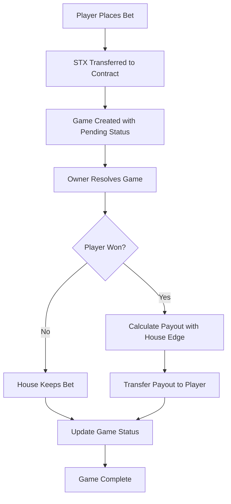

# Dice Game

A decentralized dice betting game built on the Stacks blockchain using Clarity smart contracts. Players can bet on specific numbers or high/low outcomes with configurable house edge and automatic payouts.

## Features

- **Two Betting Types**: Number-specific bets (1-6) and High/Low bets
- **Configurable House Edge**: Adjustable from 0% to 20% (default 5%)
- **Automatic Payouts**: Winners receive payouts automatically upon game resolution
- **Contract Balance Tracking**: Transparent fund management
- **Owner Controls**: Administrative functions for house edge and fund management
- **Minimum Bet Protection**: 1 STX minimum bet to prevent spam

## Contract Overview

### Constants

```clarity
min-bet-amount: 1,000,000 micro-STX (1 STX)
max-house-edge: 20%
number-bet-multiplier: 6x
high-low-bet-multiplier: 2x
```

### Betting Types

1. **Number Bet**: Bet on a specific number (1-6)
   - Payout: 6x multiplier (minus house edge)
   - Win condition: Exact number match

2. **High/Low Bet**: Bet on range outcome
   - High: 4, 5, 6
   - Low: 1, 2, 3
   - Payout: 2x multiplier (minus house edge)

## Installation & Deployment

### Prerequisites

- [Clarinet](https://github.com/hirosystems/clarinet) v0.31.1 or higher
- Stacks CLI

### Setup

1. Clone or download the contract:
```bash
git clone <repository-url>
cd dice-game-contract
```

2. Test the contract:
```bash
clarinet check
clarinet test
```

3. Deploy to testnet:
```bash
clarinet deploy --testnet
```

## Usage

### For Players

#### Number Betting

```clarity
;; Bet 2 STX on number 4
(contract-call? .dice-game roll-dice-number u4 u2000000)
```

#### High/Low Betting

```clarity
;; Bet 1 STX on "high" (4, 5, or 6)
(contract-call? .dice-game roll-dice-high-low "high" u1000000)

;; Bet 1 STX on "low" (1, 2, or 3)  
(contract-call? .dice-game roll-dice-high-low "low" u1000000)
```

### For Contract Owner

#### Resolve Games

```clarity
;; Resolve game #1 with dice result 5
(contract-call? .dice-game resolve-game u1 u5)
```

#### Set House Edge

```clarity
;; Set house edge to 3%
(contract-call? .dice-game set-house-edge u3)
```

#### Withdraw Funds

```clarity
;; Withdraw 10 STX from contract
(contract-call? .dice-game withdraw-funds u10000000)
```

## Public Functions

### Player Functions

| Function | Parameters | Description |
|----------|------------|-------------|
| `roll-dice-number` | `prediction: uint`, `bet-amount: uint` | Bet on specific number (1-6) |
| `roll-dice-high-low` | `prediction: string`, `bet-amount: uint` | Bet on "high" or "low" |

### Owner Functions

| Function | Parameters | Description |
|----------|------------|-------------|
| `resolve-game` | `game-id: uint`, `dice-roll: uint` | Resolve pending game with result |
| `set-house-edge` | `new-edge: uint` | Set house edge (0-20%) |
| `withdraw-funds` | `amount: uint` | Withdraw funds from contract |

## Read-Only Functions

| Function | Parameters | Returns | Description |
|----------|------------|---------|-------------|
| `get-game` | `game-id: uint` | Game details | Get complete game information |
| `get-house-edge` | - | `uint` | Current house edge percentage |
| `get-next-game-id` | - | `uint` | Next available game ID |
| `get-contract-balance` | - | `uint` | Current contract balance |
| `get-game-count` | - | `uint` | Total games created |

## Game Flow



## Data Structures

### Game Record

```clarity
{
  player: principal,           ;; Player's address
  bet-amount: uint,           ;; Amount bet in micro-STX
  prediction: uint,           ;; Encoded prediction
  bet-type: (string-ascii 20), ;; "number", "high", or "low"
  dice-result: (optional uint), ;; Actual dice roll (1-6)
  payout: uint,               ;; Payout amount
  status: (string-ascii 20),   ;; "pending", "won", or "lost"
  block-created: uint         ;; Block height when created
}
```

## Error Codes

| Code | Constant | Description |
|------|----------|-------------|
| 400 | `err-owner-only` | Function restricted to contract owner |
| 401 | `err-invalid-bet` | Invalid bet amount or parameters |
| 402 | `err-insufficient-funds` | Insufficient contract funds |
| 403 | `err-game-not-found` | Game ID does not exist |
| 404 | `err-invalid-prediction` | Invalid prediction value |
| 405 | `err-game-already-resolved` | Game already resolved |
| 406 | `err-invalid-dice-roll` | Invalid dice roll result |

## Payout Calculation

### Formula

```
gross-payout = bet-amount × multiplier
house-fee = gross-payout × (house-edge / 100)
final-payout = gross-payout - house-fee
```

### Examples

**Number Bet (5% house edge):**
- Bet: 1 STX
- Multiplier: 6x
- Gross: 6 STX
- House fee: 0.3 STX
- Payout: 5.7 STX

**High/Low Bet (5% house edge):**
- Bet: 1 STX  
- Multiplier: 2x
- Gross: 2 STX
- House fee: 0.1 STX
- Payout: 1.9 STX

## Security Features

- **Input Validation**: All user inputs validated before processing
- **Owner-Only Functions**: Administrative functions restricted to contract owner
- **Balance Tracking**: Accurate contract balance management
- **Minimum Bet**: Prevents micro-transaction spam
- **Game State Protection**: Prevents double-resolution of games
- **Safe Arithmetic**: Protected against overflow/underflow

## Testing

Run the test suite:

```bash
clarinet test
```

Example test scenarios:
- Valid number bets (1-6)
- Valid high/low bets
- Invalid predictions
- Insufficient bet amounts
- Owner-only function restrictions
- Payout calculations
- Game resolution flow

## Development

### Prerequisites

- Clarinet 0.31.1+
- Understanding of Clarity language
- Basic knowledge of Stacks blockchain

### Key Design Decisions

1. **Safe Input Handling**: All untrusted inputs validated with safe variable binding
2. **Minimal External Dependencies**: Self-contained contract with no external calls
3. **Gas Optimization**: Efficient data structures and minimal computational overhead
4. **Upgradeability**: Owner can adjust house edge for market conditions

## Contributing

1. Fork the repository
2. Create a feature branch
3. Run tests: `clarinet check && clarinet test`
4. Submit a pull request

## License

MIT License - see LICENSE file for details.

## Disclaimer

This contract is for educational and entertainment purposes. Gambling may be regulated or prohibited in your jurisdiction. Use responsibly and at your own risk.